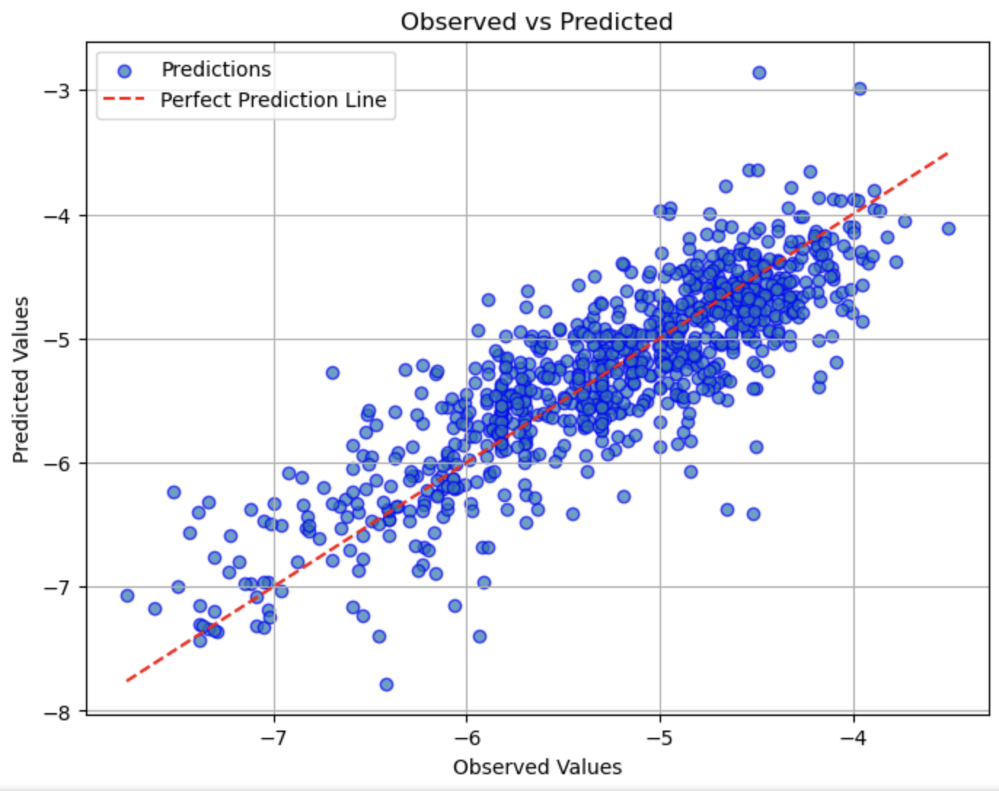
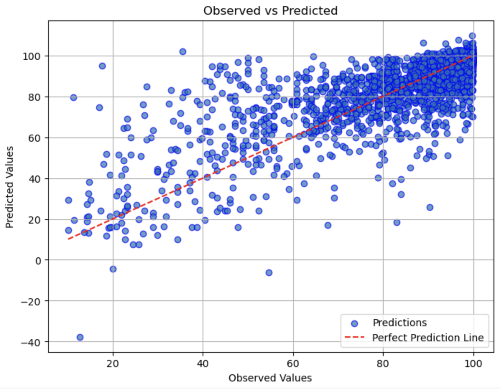
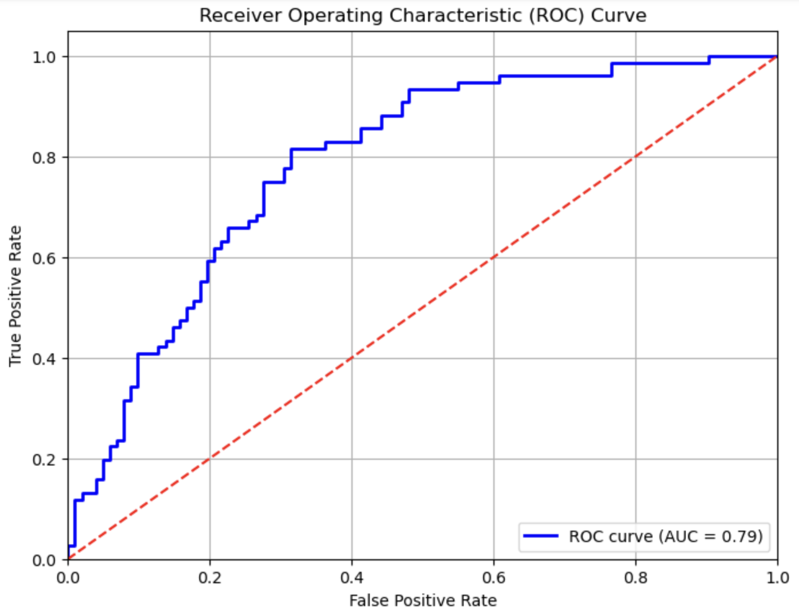
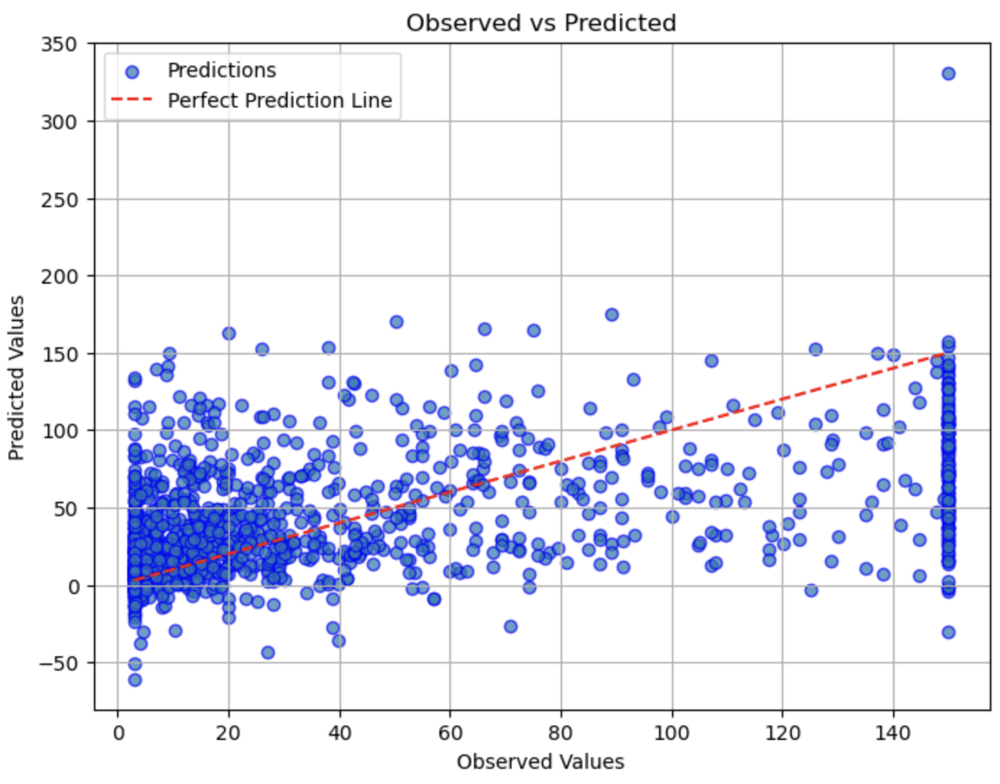
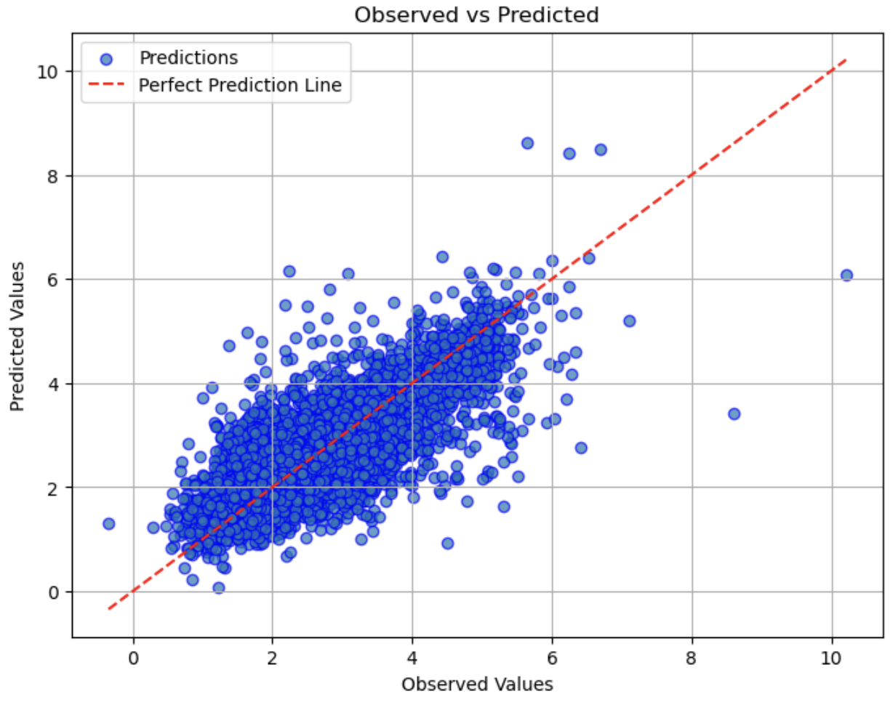

# Admetica

It is an open-source global effort with collaborators from academia, biotech startups and big pharma.

Our goal is to improve ADMET (Absorption, Distribution, Metabolism, and Excretion) prediction tools.

We welcome everyone with the expertise in the field. If you're interested in collaboration, contact us via [email](mailto:oserhiienko@datagrok.ai) or [LinkedIn](https://www.linkedin.com/in/oleksandra-serhiienko-674ab6239).

## Table of Contents

- [Goals](#goals)
- [Integration with Datagrok](#integration-with-datagrok)
- [Available predictive models](#available-predictive-models)
  - [Absorption](#absorption)
  - [Distribution](#distribution)
  - [Metabolism](#metabolism)
  - [Excretion](#excretion)
  - [Toxicity](#toxicity)
- [Comparison of Admetica and Novartis models](#comparison-of-admetica-and-novartis-models)
- [Evaluation of free online ADMET tools](#evaluation-of-free-online-admet-tools)
- [Usage](#usage)
  - [Installation](#installation)
  - [Data](#data)
  - [Training](#training)
  - [Predicting](#predicting)
- [References](#references)

Our goal is to provide a tool that is:

- **Accurate**: It has higher characteristics compared to other open-source tools such as ADMETLab, Chemprop, QikProp etc.
- **Open-source**: The source code is freely available for anyone to view, use, modify and distribute.
- **With simple API**: It has an easy-to-use interface and can be integrated into various applications and platforms.
- **Reproducible**: You can access data sources, modeling workflow notebooks and models to easily reproduce and verify the entire modeling process.
- **Easily deployable**: It is easy to set up and use.
- **Performant**: It offers a reliable and high-performance solution for datasets of all sizes.

## Integration with Datagrok

Our tool easily works with many platforms and applications. With the [Admetica package](https://github.com/datagrok-ai/public/tree/master/packages/Admetica) developed at Datagrok, you can:

- **Mix your data:** Combine your data with Datagrok's collected experimental data for customized predictive models.

- **Visualize results:** Use Datagrok tools for better predictions, data analysis and data visualization.

## Available predictive models

Currently, we have a total of 32 predictive models developed for [Absorption](#absorption), [Distribution](#distribution), [Metabolism](#metabolism), [Excretion](#excretion) and Toxicity.

### Absorption

#### Classification models

Name | Model | Size | Specificity | Sensitivity | Accuracy | Balanced Accuracy | ROC AUC |
|-|-|-|-|-|-|-|-|
| [Pgp-Inhibitor](./absorption/absorption.md#pgp-inhibitor) | Chemprop | 1,275 | 0.916 | 0.863 |  0.888 | 0.889  |  |

#### Regression models

Name | Model | Size | MAE | RMSE | R2 | Spearman | Observed vs. Predicted |
|-|-|-|-|-|-|-|-|
| [Caco2](./absorption/absorption.md#caco-2) | Chemprop | 910 | 0.317 | 0.415 | 0.701 |  0.832 |  |
| [Lipophilicity](./absorption/absorption.md#lipophilicity) | Chemprop | 4200 | 0.399 | 0.596 | 0.748 | 0.881 |  |
| [Solubility](./absorption/absorption.md#solubility) | Chemprop | 9982 | 0.714 | 1.089 | 0.788 | 0.897 |  |

### Distribution

#### Regression models

Name | Model | Size | MAE | RMSE | R2 | Spearman | Observed vs. Predicted |
|-|-|-|-|-|-|-|-|
| [PPBR](./distribution/distribution.md#ppbr) | Chemprop | 2790 | 6.919 | 11.294 | 0.609 | 0.762 |  |

### Metabolism

#### Classification models

Name | Model | Size | Specificity | Sensitivity | Accuracy | Balanced Accuracy | ROC AUC
|-|-|-|-|-|-|-|-|
| [CYP1A2-Inhibitor](./absorption/absorption.md#cyp1a2-inhibitor) | Chemprop | 13,239 | 0.873 | 0.866 |  0.87 | 0.869 |  |
| [CYP3A4-Inhibitor](./absorption/absorption.md#cyp3a4-inhibitor) | Chemprop | 12,997 | 0.815 | 0.842 |  0.826 | 0.829 |  |
| [CYP3A4-Substrate](./absorption/absorption.md#cyp3a4-substrate) | Chemprop | 1,149 |  0.569 | 0.779 |  0.718 |  0.674 |  |
| [CYP2C19-Inhibitor](./absorption/absorption.md#cyp2c19-inhibitor) | Chemprop | 13,427 | 0.819 | 0.830 |  0.824 | 0.825  |  |
| [CYP2C9-Inhibitor](./absorption/absorption.md#cyp2c9-inhibitor) | Chemprop | 12,881 | 0.830 | 0.819 |  0.826 | 0.824 |  |
| [CYP2C9-Substrate](./absorption/absorption.md#cyp2c9-substrate) | Chemprop | 899 | 0.728 | 0.757 |  0.738 | 0.742 |  |
| [CYP2D6-Inhibitor](./absorption/absorption.md#cyp2d6-inhibitor) | Chemprop | 11,127 | 0.866 | 0.751 |  0.843 | 0.808 |  |
| [CYP2D6-Substrate](./absorption/absorption.md#cyp2d6-substrate) | Chemprop | 941 | 0.749 | 0.769 |  0.753 | 0.759 |  |

Here is a line chart illustrating various metrics for each of the corresponding models.


### Excretion

#### Regression models

Name | Model | Size | MAE | RMSE | R2 | Spearman | Observed vs. Predicted |
|-|-|-|-|-|-|-|-|
| [Clearance Hepatocyte](./excretion/excretion.md#hepatocyte) | Chemprop | 1213 | 34.103 | 47.144 | 0.086 | 0.485 |  |
| [Clearance Microsome](./excretion/excretion.md#microsome) | Chemprop | 1102 |  26.715 | 39.201 | 0.216 | 0.576 |  |

### Toxicity

### Classification models

Name | Model | Size | Specificity | Sensitivity | Accuracy | Balanced Accuracy | ROC AUC
|-|-|-|-|-|-|-|-|
| [hERG](./ADMET/toxicity/toxicity.md#herg) | Chemprop | 22,249 | 0.811 | 0.897 | 0.885 |  0.854  |  |

#### Regression models

Name | Model | Size | MAE | RMSE | R2 | Spearman | Observed vs. Predicted |
|-|-|-|-|-|-|-|-|
| [LD50](./toxicity/toxicity.md#) | Chemprop | 7282 |  0.437 | 0.609 | 0.596 | 0.745 |  |

## Comparison of Admetica and Novartis models

We conducted the comparison for two main reasons:

- To explore the potential of using the surrogate dataset to enrich our predictions.
- To benchmark the performance of the Novartis machine learning model against our own results.

For this, we utilized the surrogate dataset from the paper [Application of machine learning models for property prediction to targeted protein degraders](https://www.nature.com/articles/s41467-024-49979-3), which includes publicly available structures and their predicted properties generated by the Novartis model.

### Cytochrome P450

### Pipeline

We generated test datasets using data from the ChEMBL database. To ensure the test set was representative and produced accurate results, the data was preprocessed using the following steps:

* **Extracting common structures**:  
  
  We compared the Novartis and ChEMBL datasets to identify shared molecular structures. Additionally, we filtered out values that overlapped with the Admetica training set to prevent redundancy.

* **Filtering the ChEMBL dataset**:  
  We removed duplicate entries, prioritizing those labeled as IC50. We also excluded rows with undesired types such as Drug metabolism, FC, Retention_time, T1/2, mechanism based inhibition, Stability etc.

* **Processing values**:  
  We standardized key values for consistency.

  | **Type**                | **Action**                                      |
  |-------------------------|-------------------------------------------------|
  | IC50, AC50, KI, Potency  | Converted to µM by dividing the values by 1000 |
  | Inhibition   | Classified as binary: |
  | | Greater than 50%: `1` |
  | | Less than 50%: `0`    |
  | Other values | Left unchanged (already in µM) |

Both the original ChEMBL dataset and the processed data are available in the [comparison](./comparison/novartis/cyp/) folder. Additionally, the folder contains a Jupyter notebook, [preprocessing_pipeline.ipynb](./comparison/preprocessing_pipeline.ipynb), which fully reproduces the preprocessing steps and obtained datasets.

### 3A4

After performing the pipeline for ChEMBL 3A4, we obtained a dataset structured as follows:

| **Class** | **Number of entries** |
|-----------|-----------------------|
| Inhibitor   | 549                   |
| Non-Inhibitor   | 239                   |

We calculated CYP3A4-Inhibitor and assessed performance metrics for the Admetica and Novartis models, resulting in the following outcomes:

| **Metric**                | **Admetica**   | **Novartis**   |
|---------------------------|-----------------------|-----------------------|
| True Positives (TP)      | 134.0                 | 159.0                 |
| True Negatives (TN)      | 368.0                 | 352.0                 |
| False Positives (FP)     | 181.0                 | 197.0                 |
| False Negatives (FN)     | 105.0                 | 80.0                  |
| Sensitivity (Recall)     | 0.5607                | 0.6653                |
| Specificity              | 0.6703                | 0.6412                |
| Balanced Accuracy         | 0.6155                | 0.6532                |
| AUC                       | 0.6155                | 0.6532                |


### 2C9

After performing the pipeline for ChEMBL 2C9, we obtained a dataset structured as follows:

| **Class** | **Number of entries** |
|-----------|-----------------------|
| Inhibitor   | 329                   |
| Non-Inhibitor   | 135                   |

We calculated CYP2C9-Inhibitor and assessed performance metrics for the Admetica and Novartis models, resulting in the following outcomes:

| **Metric**                | **Admetica**    | **Novartis**   |
|---------------------------|-----------------------|-----------------------|
| True Positives (TP)      | 102.0                 | 69.0                  |
| True Negatives (TN)      | 137.0                 | 236.0                 |
| False Positives (FP)     | 192.0                 | 93.0                  |
| False Negatives (FN)     | 33.0                  | 66.0                  |
| Sensitivity (Recall)     | 0.7556                | 0.5111                |
| Specificity              | 0.4164                | 0.7173                |
| Balanced Accuracy         | 0.5860                | 0.6142                |
| AUC                       | 0.5860                | 0.6142                |


### 2D6

After performing the pipeline for ChEMBL 2D6, we obtained a dataset structured as follows:

| **Class** | **Number of entries** |
|-----------|-----------------------|
| Inhibitor   | 444                   |
| Non-Inhibitor   | 195                   |

We calculated CYP2D6-Inhibitor and assessed performance metrics for the Admetica and Novartis models, resulting in the following outcomes:

| **Metric**                | **Admetica**   | **Novartis**   |
|---------------------------|-----------------------|-----------------------|
| True Positives (TP)      | 88.0                  | 55.0                  |
| True Negatives (TN)      | 329.0                 | 403.0                 |
| False Positives (FP)     | 115.0                 | 41.0                  |
| False Negatives (FN)     | 107.0                 | 140.0                 |
| Sensitivity (Recall)     | 0.4513                | 0.2821                |
| Specificity              | 0.7410                | 0.9077                |
| Balanced Accuracy         | 0.5961                | 0.5949                |
| AUC                       | 0.5961                | 0.5949                |


The comparison is fully reproducible, and you can find the Jupyter notebook, [comparison_cyp.ipynb](./comparison/comparison_cyp.ipynb), in the folder.


### Caco-2 permeability

We generated test datasets using data from the supplementary material of the paper [In Silico Prediction of Caco-2 Cell Permeability by a Classification QSAR Approach](https://pubmed.ncbi.nlm.nih.gov/27466954/). The following preprocessing steps were applied:

*  **Identifying common structures**:

   We compared the Novartis and Caco-2 dataset to identify shared molecular structures. Additionally, we filtered out values that overlapped with the Admetica training set to prevent redundancy.
   
* **Unit normalization**:  
   
   To ensure consistent units across all datasets predicting Caco-2 permeability (including Novartis and Admetica), we applied a log10 transformation to the values.

After performing the preprocessing for Caco-2, we obtained a dataset that contains 34 structures.

We calculated Caco-2 and assessed performance metrics for the Admetica and Novartis models, resulting in the following outcomes:

| **Metric**   | **Admetica**   | **Novartis**   |
|--------------|----------------|----------|
| MAE          | 0.411552       | 0.351543 |
| MSE          | 0.286792       | 0.201841 |
| RMSE         | 0.535530       | 0.449267 |
| R²           | 0.319010       | 0.520728 |

<table>
  <tr>
    <td></td>
    <td></td>
  </tr>
</table>

Both the original Caco-2 dataset and the processed data are available in the [comparison](./comparison/novartis/caco2/) folder. Additionally, the folder contains a Jupyter notebook, [comparison_caco2.ipynb](./comparison/comparison_caco2.ipynb), which fully reproduces the preprocessing steps, obtained datasets and metrics.

### Results

During our model comparison, we discovered that the Novartis model outperformed the Admetica model for the targets CYP3A4, CYP2C9, and Caco2.

## Model enhancement

After performing the comparison and seeing that in some cases the Novartis model is better, we consequently opted to continue training with the surrogate Novartis data used in our comparison.

Given the significant class imbalance in the data for CYP3A4 and CYP2C9, we implemented under-sampling techniques to reduce the risk of overfitting during the training process.

| **Property** | **Class distribution** | **Number of rows in final dataset** |
|--------------|-----------------------|-------------------------------------|
| **CYP3A4**   | 0: 22618, 1: 22618    | 57781                               |
| **CYP2C9**   | 0: 3975, 1: 3975      | 20299                               |

This table summarizes the class distributions and the row counts in the final dataset for each property.

For further details, the [comparison](./comparison/) folder contains a Jupyter notebook, [undersampling.ipynb](./comparison/undersampling.ipynb), that fully reproduces the process of obtaining the final datasets for training.

## Evaluation of free online ADMET tools

For our evaluation, we used 24 tyrosine kinase inhibitors (TKIs) and a comparison table from the supplementary materials of the study [Evaluation of Free Online ADMET Tools for Academic or Small Biotech Environments](https://pubmed.ncbi.nlm.nih.gov/36677832/). The table contained predictions for the 24 structures from various web services, including ADMETlab, admetSAR, SwissADME, and others. Since the table was slightly outdated, we updated the ADMETlab 2.0 predictions with those from ADMETlab 3.0.

### Plasma Protein Binding

We compared plasma protein binding (PPB) predictions for 24 tyrosine kinase inhibitors (TKIs) using four tools: [ADMETLab](https://admetlab3.scbdd.com/), [admetSAR](https://lmmd.ecust.edu.cn/admetsar2/), [preADMET](https://preadmet.webservice.bmdrc.org/), and Admetica. The plot below shows the results.


| Model      |        MSE        |       MAE       |       RMSE       |
|------------|-------------------|------------------|-------------------|
| ADMETLab   |  37.42            |  3.25            |  6.12             |
| admetSAR   | 148.04            |  6.71            | 12.17             |
| Admetica   | 139.08            |  8.52            | 11.79             |
| preADMET   | 265.00            | 13.00            | 16.28             |

ADMETLab consistently provided the most accurate predictions, achieving the lowest error metrics across all measures (MSE, MAE, RMSE). Admetica and admetSAR had similar performance, with Admetica exhibiting slightly better metrics overall, despite both having higher error rates compared to ADMETLab. PreADMET showed the least accuracy overall, as indicated by its significantly higher error metrics. Overall, ADMETLab remains the top choice for precise plasma protein binding predictions.

### Half-Life

Among all online web services, only [ADMETLab](https://admetlab3.scbdd.com/) provides predictions for Half-Life. To assess the accuracy of these predictions, we performed a comparative analysis between ADMETLab and Admetica for 24 structures.


| Model      |        MSE         |       MAE         |       RMSE        |
|------------|--------------------|--------------------|--------------------|
| ADMETLab   | 1647.99            | 32.86              | 40.60              |
| Admetica   | 1162.88            | 29.21              | 34.10              |

ADMETLab tends to underestimate Half-Life predictions compared to actual values, resulting in relatively high error metrics. In contrast, Admetica often overestimates Half-Life, but it has lower error metrics overall. This disparity highlights the importance of carefully evaluating the predictions from both tools, as they exhibit different tendencies in their predictions, leading to significant variability.

### CYP3A4-Substrate

We compared CYP3A4 substrate predictions using five tools: [ADMETLab](https://admetlab3.scbdd.com/), [admetSAR](https://lmmd.ecust.edu.cn/admetsar2/), [pkCSM](http://pkcsmlab.com/), [preADMET](https://preadmet.webservice.bmdrc.org/), and Admetica.


| Model      | Accuracy | Precision | Recall | F1 Score |
|------------|----------|-----------|--------|----------|
| ADMETLab   |   0.83   |    1.0    |  0.83  |   0.91   |
| admetSAR   |   1.0    |    1.0    |  1.0   |   1.0    |
| pkCSM      |   0.96   |    1.0    |  0.96  |   0.98   |
| preADMET   |   0.46   |    1.0    |  0.46  |   0.63   |
| Admetica   |   0.96   |    1.0    |  0.96  |   0.98   |

The results revealed that admetSAR was the best-performing model, demonstrating exceptional accuracy in predicting CYP3A4 substrates. Both pkCSM and Admetica also showed strong performance, making them reliable options for these predictions. ADMETLab provided decent results, but its performance was not as robust as the top three models. Conversely, preADMET exhibited the lowest performance, indicating that it is less reliable for CYP3A4 substrate predictions. Overall, we can confidently rely on admetSAR, pkCSM, and Admetica for accurate predictions in this area.

### HIA

We compared models for predicting human intestinal absorption (HIA) using six free tools: [ADMETLab](https://admetlab3.scbdd.com/), [admetSAR](https://lmmd.ecust.edu.cn/admetsar2/), [FAF-Drug4](https://fafdrugs4.rpbs.univ-paris-diderot.fr/), [pkCSM](http://pkcsmlab.com/), [SwissADME](http://www.swissadme.ch/), and Admetica.


| Model       | Accuracy | Precision | Recall |
|-------------|----------|-----------|--------|
| ADMETLab    |   0.62   |   0.61    |  1.0   |
| SwissADMET  |   0.62   |   0.63    |  0.86  |
| admetSAR    |   0.58   |   0.58    |  1.0   |
| FAF-Drug4   |   0.58   |   0.58    |  1.0   |
| pkCSM       |   0.58   |   0.58    |  1.0   |
| Admetica    |   0.58   |   0.58    |  1.0   |

ADMETLab and SwissADMET demonstrated the highest accuracy, effectively identifying absorbed compounds, while admetSAR, FAF-Drug4, pkCSM, and Admetica showed similar performance levels but lower precision. Overall, all models exhibited perfect recall, indicating their effectiveness in identifying absorbed compounds, though there is still room for improvement in minimizing false positives.

You can find both the original dataset and the processed data in the [comparison](./comparison/predictors/) folder. This folder also includes a Jupyter notebook, [comparison_services.ipynb](./comparison/comparison_services.ipynb), that reproduces the steps taken to conduct the comparison.

### Summary

Below is a summary table of the most notable metrics from the evaluation of free online ADMET tools using predictions for 24 tyrosine kinase inhibitors (TKIs).

| Model      | PPB (F1) | Half-Life (MAE) | CYP3A4 Substrate (F1) | HIA (Accuracy) |
|------------|----------|------------------|------------------------|-----------------|
| ADMETLab   | 0.91     | 32.86            | 0.83                   | 0.62            |
| admetSAR   | 1.00     | N/A              | 1.00                   | 0.58            |
| Admetica   | 0.98     | 29.21            | 0.98                   | 0.58            |
| pkCSM      | N/A      | N/A              | 0.98                   | 0.58            |
| preADMET   | N/A      | N/A              | 0.63                   | 0.58            |
| FAF-Drug4  | N/A      | N/A              | N/A                    | 0.58            |
| SwissADME  | N/A      | N/A              | N/A                    | 0.62            |

## Usage

### Installation

[](https://badge.fury.io/py/chemprop)
[](https://badge.fury.io/py/chemprop)

Admetica is a powerful tool for making ADMET predictions and can be easily installed on any operating system. You can install it using pip, and optionally, you can set up a conda environment for better package management.

#### Creating a Conda Environment (Optional)

To create a new conda environment and install Admetica, use the following commands:

```bash
conda create --name admetica-env python=3.11
conda activate admetica-env
```

#### Installing Admetica

To install Admetica, run:

```bash
pip install admetica==1.3
```

By default, the pip installation will include all necessary dependencies for making ADMET predictions.

### Making Predictions

Admetica provides a command-line interface to make predictions. To use it, run:

```bash
admetica_predict \
    --dataset-path data.csv \
    --smiles-column smiles \
    --properties Caco2,PPBR \
    --save-path predictions.csv
```

This command assumes the presence of a file named `data.csv` with SMILES strings in the column `smiles`. In addition, you should specify the properties to be calculated (e.g. `Caco2`). The predictions will be saved to `predictions.csv`.

All models available in the repository are included and can be used.

### Data

In order to train a model or obtain predictions, you must provide data containing molecules (as SMILES strings) and known target values.

The data used in this research and [its overview](./docs/datasets.md) can be found in the `Datasets` folder.

### Training

You can create a model on your own using [chemprop](https://github.com/chemprop/chemprop/blob/master/README.md#training) module or use publicly available models that are licalted in the `Models` folder.

### Predicting

To load a trained model and make predictions, run all the commands specified in the `Chemical Property Prediction and Evaluation.ipynb` file.

## References

Our project is about improving and combining existing solutions, not reinventing the wheel. Here is the list of resources we've investigated:

1. ADMETlab: a platform for systematic ADMET evaluation based on a comprehensively collected ADMET database / Jie Dong, Ning-Ning Wang, Zhi-Jiang Yao та ін. // J Cheminform. – 2018. – <https://www.ncbi.nlm.nih.gov/pmc/articles/PMC6020094/>.
2. Evaluation of Free Online ADMET Tools for Academic or Small Biotech Environments / Júlia Dulsat, Blanca López-Nieto, Roger Estrada-Tejedor, José I. Borrell // Molecules. – 2023. – <https://www.ncbi.nlm.nih.gov/pmc/articles/PMC9864198/>.
3. Vishwesh Venkatraman. FP-ADMET: a compendium of fingerprint-based ADMET prediction models / Vishwesh Venkatraman // J Cheminform. – 2021. – <https://www.ncbi.nlm.nih.gov/pmc/articles/PMC8479898/>.
4. Front Pharmacol. vNN Web Server for ADMET Predictions / Front Pharmacol // Front Pharmacol. – 2017. – <https://www.ncbi.nlm.nih.gov/pmc/articles/PMC5722789/>.
5. ADMETlab 2.0: an integrated online platform for accurate and comprehensive predictions of ADMET properties / Guoli Xiong, Zhenxing Wu, Jiacai Yi та ін. // Nucleic Acids Res. – 2021. – <https://www.ncbi.nlm.nih.gov/pmc/articles/PMC8262709/>.
6. In silico Prediction of Chemical Ames Mutagenicity / Congying Xu, Feixiong Cheng, Lei Chen та ін. // J Cheminform. – 2012. – <https://pubs.acs.org/doi/abs/10.1021/ci300400a>.
7. Computational Models for Human and Animal Hepatotoxicity with a Global Application Scope / Denis Mulliner, Friedemann Schmidt, Manuela Stolte та ін. // Chem. Res. Toxicol.. – 2016. – <https://pubs.acs.org/doi/10.1021/acs.chemrestox.5b00465>.
8. ADMET Evaluation in Drug Discovery. 16. Predicting hERG Blockers by Combining Multiple Pharmacophores and Machine Learning Approaches / Shuangquan Wang, Huiyong Sun, Hui Liu та ін. // Mol. Pharmaceutics. – 2016. – <https://pubs.acs.org/doi/10.1021/acs.molpharmaceut.6b00471>.
