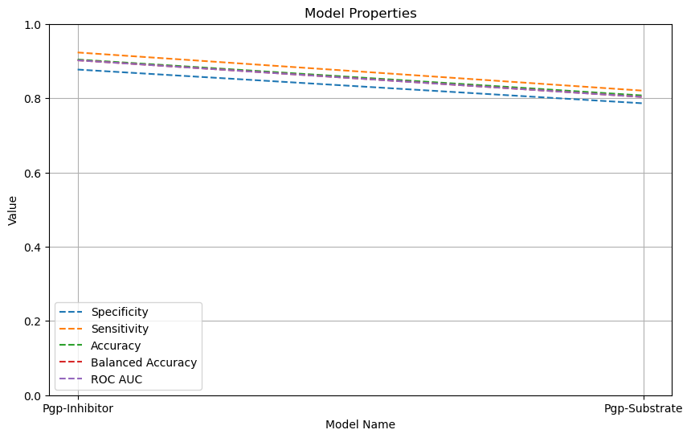
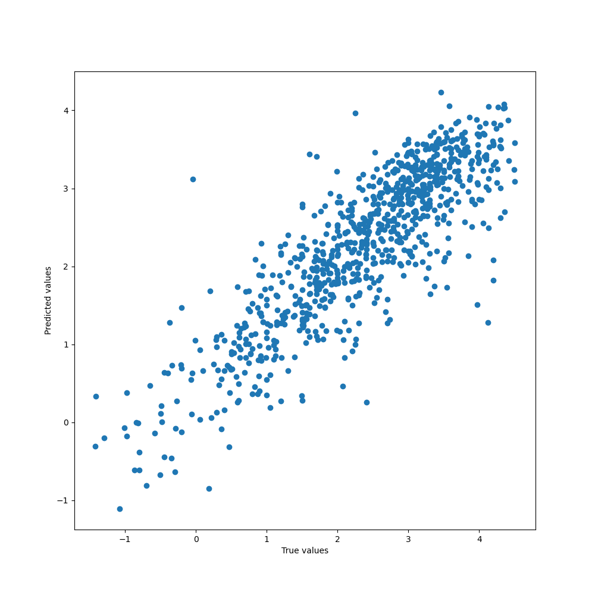
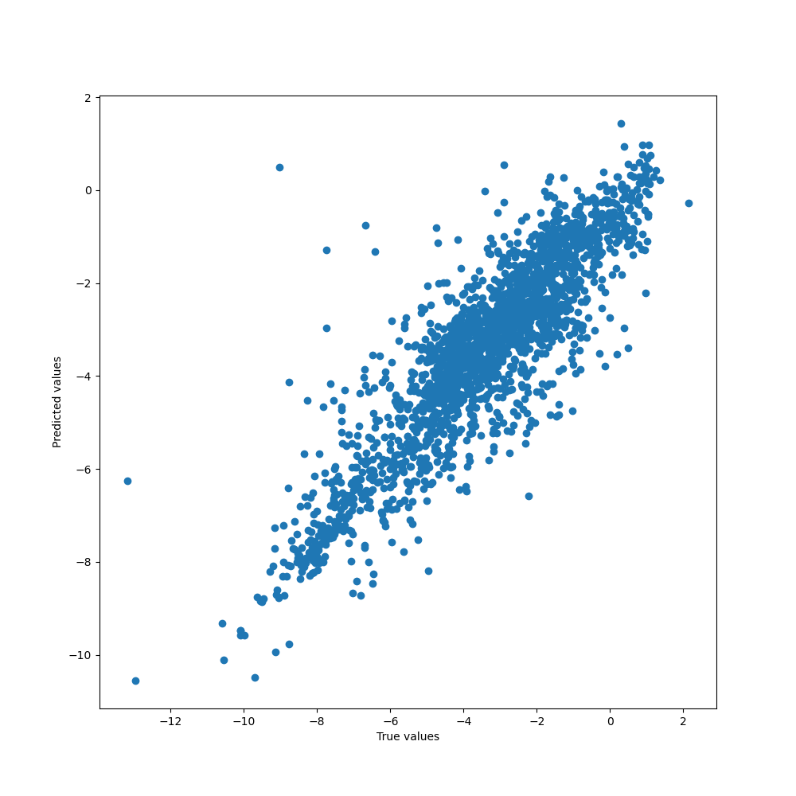
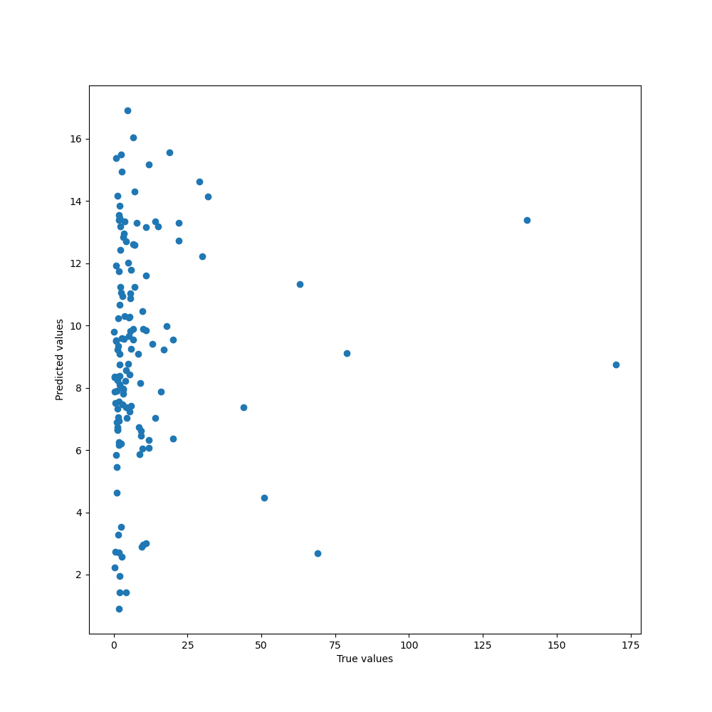
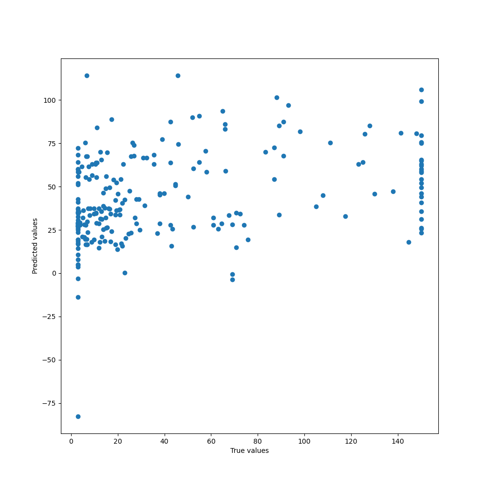
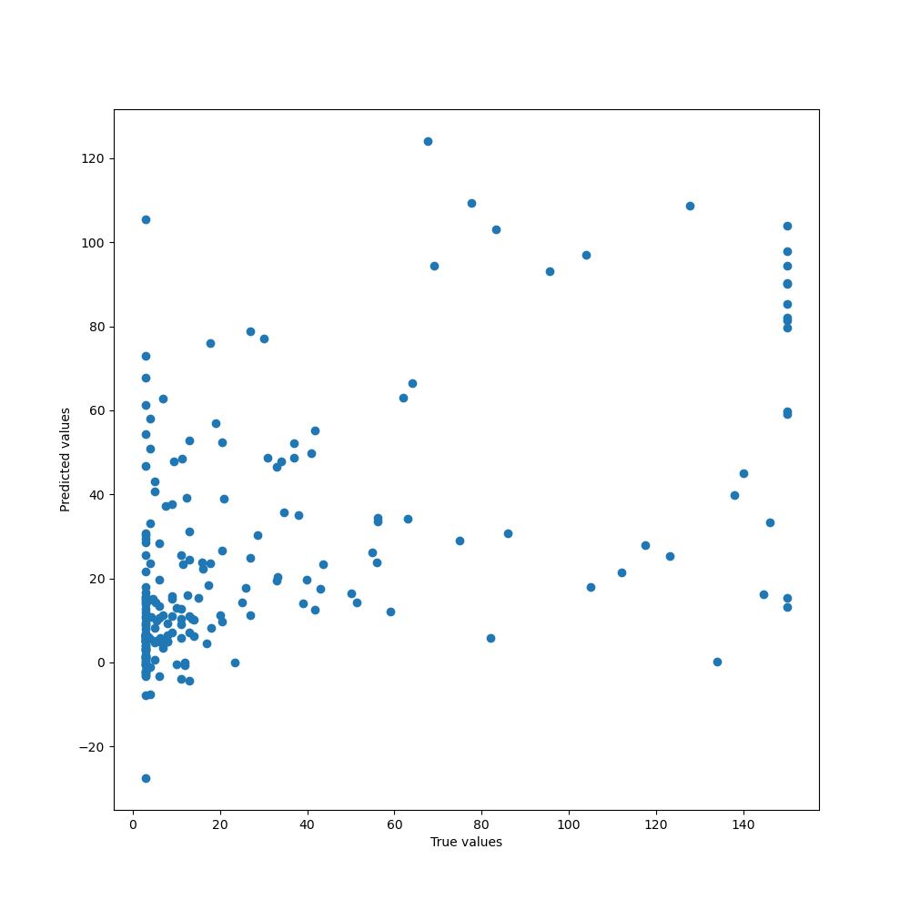

# Admetica

It is an open-source global effort with collaborators from academia, biotech startups and big pharma.

Our goal is to improve ADMET (Absorption, Distribution, Metabolism, and Excretion) prediction tools.

We welcome everyone with the expertise in the field. If you're interested in collaboration, contact us via [email](mailto:oserhiienko@datagrok.ai) or [LinkedIn](https://www.linkedin.com/in/oleksandra-serhiienko-674ab6239).

## Table of Contents

- [Goals](#goals)
- [Integration with Datagrok](#integration-with-datagrok)
- [Available predictive models](#available-predictive-models)
  - [Absorption](#absorption)
  - [Distribution](#distribution)
  - [Metabolism](#metabolism)
  - [Excretion](#excretion)
- [Usage](#usage)
  - [Installation](#installation)
  - [Data](#data)
  - [Training](#training)
  - [Predicting](#predicting)
- [References](#references)

## Goals

Our goal is to provide a tool that is:

- **Accurate**: It has higher characteristics compared to other open-source tools such as ADMETLab, Chemprop, QikProp etc.
- **Open-source**: The source code is freely available for anyone to view, use, modify and distribute.
- **With simple API**: It has an easy-to-use interface and can be integrated into various applications and platforms.
- **Reproducible**: You can access data sources, modeling workflow notebooks and models to easily reproduce and verify the entire modeling process.
- **Easily deployable**: It is easy to set up and use.
- **Performant**: It offers a reliable and high-performance solution for datasets of all sizes.

## Integration with Datagrok

Our tool easily works with many platforms and applications. With the [Admetica package](https://github.com/datagrok-ai/public/tree/master/packages/Admetica) developed at Datagrok, you can:

- **Mix your data:** Combine your data with Datagrok's collected experimental data for customized predictive models.

- **Visualize results:** Use Datagrok tools for better predictions, data analysis and data visualization.

## Available predictive models

Currently, we have a total of 32 predictive models developed for [Absorption](#absorption), [Distribution](#distribution), [Metabolism](#metabolism), [Excretion](#excretion) and Toxicity.

### Absorption

#### Classification models

Name | Model | Size | Specificity | Sensitivity | Accuracy | Balanced Accuracy | ROC AUC |
|-|-|-|-|-|-|-|-|
| [Pgp-Inhibitor](./Descriptions/Absorption.md#pgp-inhibitor) | Chemprop | 1,275 | 0.877 | 0.923 |  0.904 | 0.902 |  |
| [Pgp-Substrate](./Descriptions/Absorption.md#pgp-substrate) | Chemprop | 332 | 0.786 | 0.820 |  0.807 | 0.803 |  |

Below is a line chart that visually represents various metrics for the respective models.



#### Regression models

Name | Model | Size | MAE | RMSE | R2 | Spearman | True vs. Predicted | True vs. Residuals |
|-|-|-|-|-|-|-|-|-|
| Caco2 | Chemprop | 910 | 0.417 | 0.528 | 0.408 | 0.816 |  |  |
| Lipophilicity | Chemprop | 4200 | 0.456 | 0.612 | 0.734 | 0.842 |  |  |
| Solubility | Chemprop | 9982 | 0.825 | 1.118 | 0.762 | 0.852 |  |  |

### Distribution

#### Regression models

Name | Model | Size | MAE | RMSE | R2 | Spearman | True vs. Predicted | True vs. Residuals |
|-|-|-|-|-|-|-|-|-|
| PPBR | Chemprop | 2790 | 7.945 | 11.642 | 0.410 | 0.650 |  |  |
| VDss | Chemprop | 1130 | 3.100 | 5.232 | 0.069 | 0.500 |  |  |

### Metabolism

#### Classification models

Name | Model | Size | Specificity | Sensitivity | Accuracy | Balanced Accuracy | ROC AUC
|-|-|-|-|-|-|-|-|
| [CYP1A2-Inhibitor](./Descriptions/Metabolism.md#cyp1a2-inhibitor) | Chemprop | 13,239 | 0.899 | 0.956 |  0.925 | 0.928 |  |
| [CYP3A4-Inhibitor](./Descriptions/Metabolism.md#cyp3a4-inhibitor) | Chemprop | 12,997 | 0.861 | 0.949 |  0.896 | 0.905 |  |
| [CYP3A4-Substrate](./Descriptions/Metabolism.md#cyp3a4-substrate) | Chemprop | 1,149 | 0.562 | 0.857 |  0.776 | 0.709 |  |
| [CYP2C19-Inhibitor](./Descriptions/Metabolism.md#cyp2c19-inhibitor) | Chemprop | 13,427 | 0.887 | 0.890 |  0.888 | 0.889 |  |
| [CYP2C9-Inhibitor](./Descriptions/Metabolism.md#cyp2c9-inhibitor) | Chemprop | 12,881 | 0.899 | 0.880 |  0.893 | 0.890 |  |
| [CYP2C9-Substrate](./Descriptions/Metabolism.md#cyp2c9-substrate) | Chemprop | 899 | 0.831 | 0.730 |  0.790 | 0.781 |  |
| [CYP2D6-Inhibitor](./Descriptions/Metabolism.md#cyp2d6-inhibitor) | Chemprop | 11,127 | 0.723 | 0.926 |  0.763 | 0.824 |  |
| [CYP2D6-Substrate](./Descriptions/Metabolism.md#cyp2d6-substrate) | Chemprop | 941 | 0.853 | 0.783 |  0.819 | 0.818 |  |

Here is a line chart illustrating various metrics for each of the corresponding models.


### Excretion

#### Regression models

Name | Model | Size | MAE | RMSE | R2 | Spearman | True vs. Predicted | True vs. Residuals  |
|-|-|-|-|-|-|-|-|-|
| Half Life | Chemprop | 667 | 9.947 | 21.780 | -0.007 | 0.208 |  |  |
| Clearance Hepatocyte | Chemprop | 1213 | 35.930 | 45.848 | 0.088 | 0.379 |  |  |
| Clearance Microsome | Chemprop | 1102 | 21.797 | 35.914 | 0.305 | 0.573 |  |  |

## Usage

### Installation

[](https://badge.fury.io/py/chemprop)
[](https://badge.fury.io/py/chemprop)

Admetica is a powerful tool for making ADMET predictions and can be easily installed on any operating system. You can install it using pip, and optionally, you can set up a conda environment for better package management.

#### Creating a Conda Environment (Optional)

To create a new conda environment and install Admetica, use the following commands:

```bash
conda create --name admetica-env python=3.11
conda activate admetica-env
```

#### Installing Admetica

To install Admetica, run:

```bash
pip install admetica==1.3
```

By default, the pip installation will include all necessary dependencies for making ADMET predictions.

### Making Predictions

Admetica provides a command-line interface to make predictions. To use it, run:

```bash
admetica_predict \
    --dataset-path data.csv \
    --smiles-column smiles \
    --properties Caco2,PPBR \
    --save-path predictions.csv
```

This command assumes the presence of a file named `data.csv` with SMILES strings in the column `smiles`. In addition, you should specify the properties to be calculated (e.g. `Caco2`). The predictions will be saved to `predictions.csv`.

All models available in the repository are included and can be used.

### Data

In order to train a model or obtain predictions, you must provide data containing molecules (as SMILES strings) and known target values.

The data used in this research and [its overview](./Datasets/README.md) can be found in the `Datasets` folder.

### Training

You can create a model on your own using [chemprop](https://github.com/chemprop/chemprop/blob/master/README.md#training) module or use publicly available models that are licalted in the `Models` folder.

### Predicting

To load a trained model and make predictions, run all the commands specified in the `Chemical Property Prediction and Evaluation.ipynb` file.

## References

Our project is about improving and combining existing solutions, not reinventing the wheel. Here is the list of resources we've investigated:

1. ADMETlab: a platform for systematic ADMET evaluation based on a comprehensively collected ADMET database / Jie Dong, Ning-Ning Wang, Zhi-Jiang Yao та ін. // J Cheminform. – 2018. – <https://www.ncbi.nlm.nih.gov/pmc/articles/PMC6020094/>.
2. Evaluation of Free Online ADMET Tools for Academic or Small Biotech Environments / Júlia Dulsat, Blanca López-Nieto, Roger Estrada-Tejedor, José I. Borrell // Molecules. – 2023. – <https://www.ncbi.nlm.nih.gov/pmc/articles/PMC9864198/>.
3. Vishwesh Venkatraman. FP-ADMET: a compendium of fingerprint-based ADMET prediction models / Vishwesh Venkatraman // J Cheminform. – 2021. – <https://www.ncbi.nlm.nih.gov/pmc/articles/PMC8479898/>.
4. Front Pharmacol. vNN Web Server for ADMET Predictions / Front Pharmacol // Front Pharmacol. – 2017. – <https://www.ncbi.nlm.nih.gov/pmc/articles/PMC5722789/>.
5. ADMETlab 2.0: an integrated online platform for accurate and comprehensive predictions of ADMET properties / Guoli Xiong, Zhenxing Wu, Jiacai Yi та ін. // Nucleic Acids Res. – 2021. – <https://www.ncbi.nlm.nih.gov/pmc/articles/PMC8262709/>.
6. In silico Prediction of Chemical Ames Mutagenicity / Congying Xu, Feixiong Cheng, Lei Chen та ін. // J Cheminform. – 2012. – <https://pubs.acs.org/doi/abs/10.1021/ci300400a>.
7. Computational Models for Human and Animal Hepatotoxicity with a Global Application Scope / Denis Mulliner, Friedemann Schmidt, Manuela Stolte та ін. // Chem. Res. Toxicol.. – 2016. – <https://pubs.acs.org/doi/10.1021/acs.chemrestox.5b00465>.
8. ADMET Evaluation in Drug Discovery. 16. Predicting hERG Blockers by Combining Multiple Pharmacophores and Machine Learning Approaches / Shuangquan Wang, Huiyong Sun, Hui Liu та ін. // Mol. Pharmaceutics. – 2016. – <https://pubs.acs.org/doi/10.1021/acs.molpharmaceut.6b00471>.
