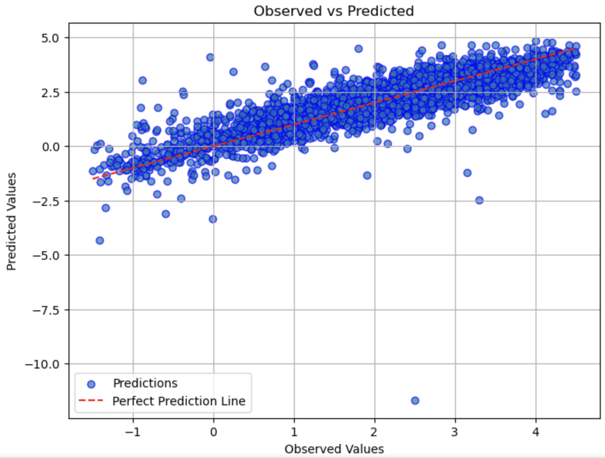
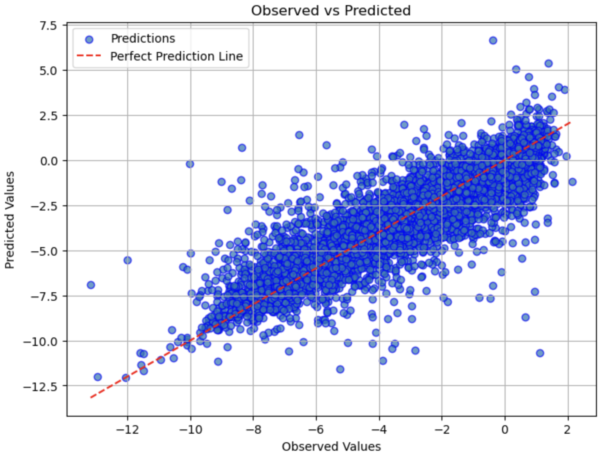
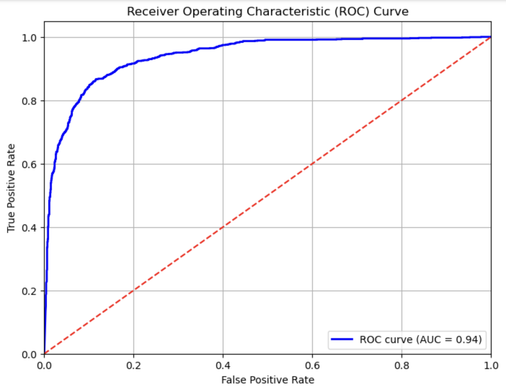
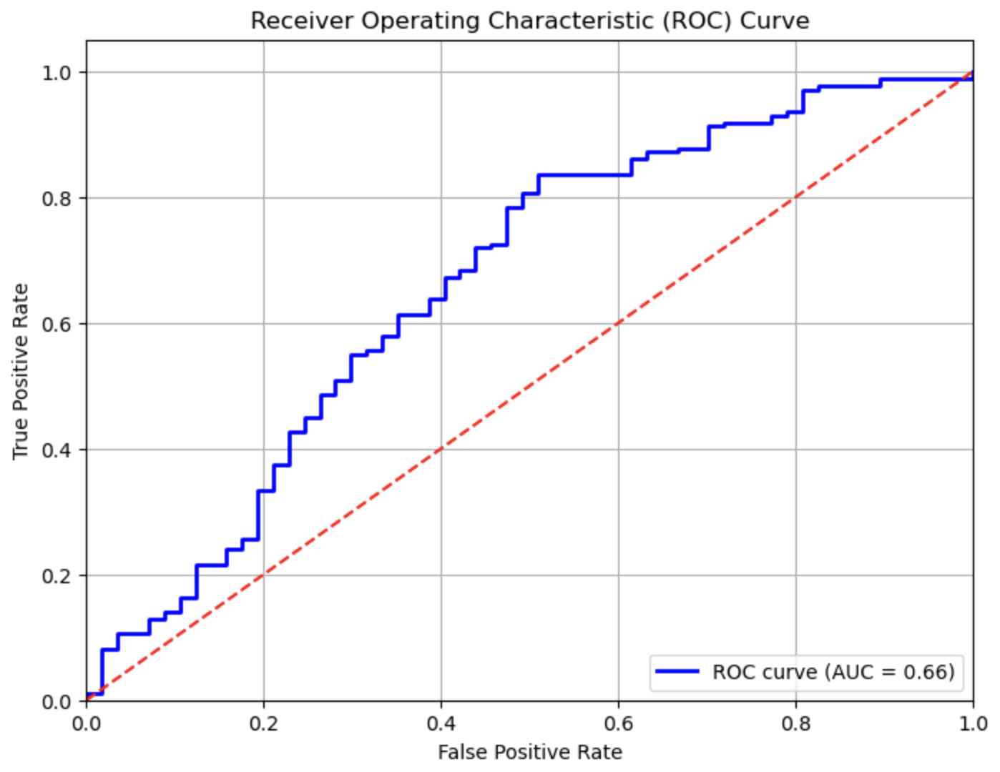
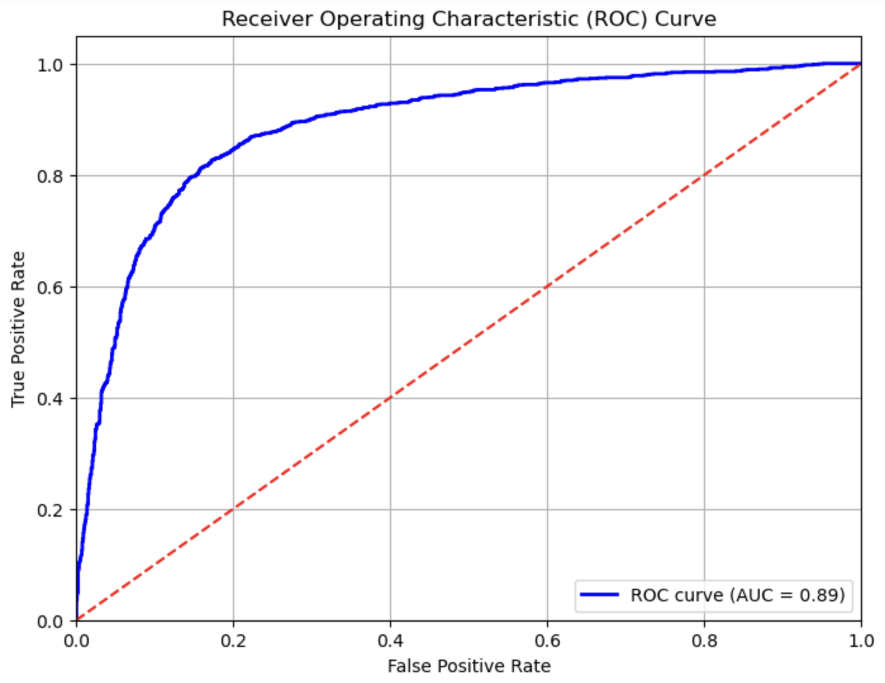
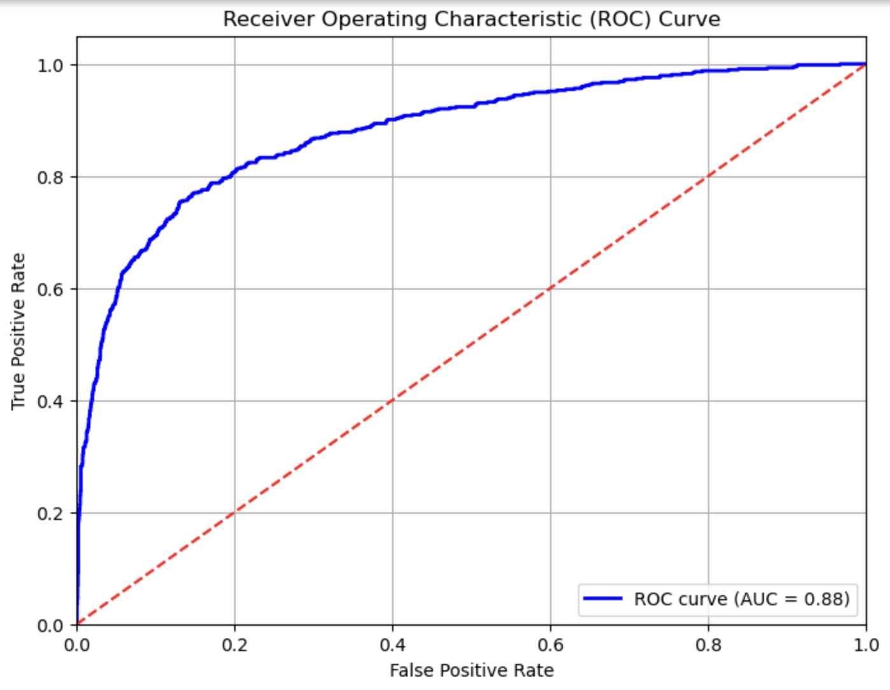
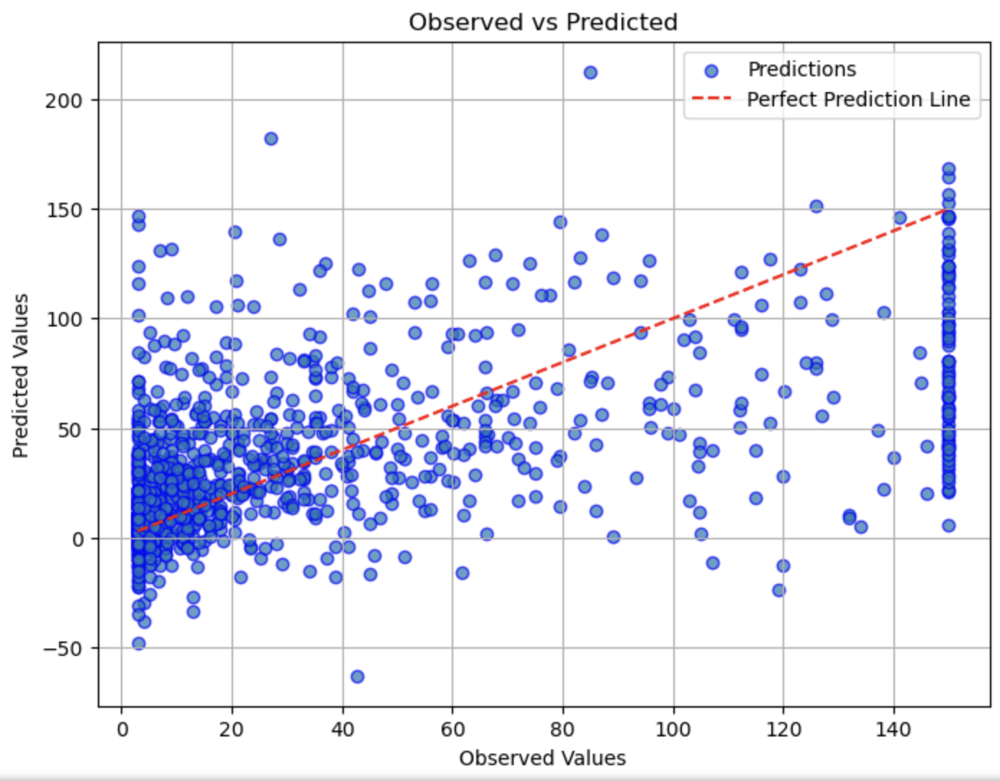
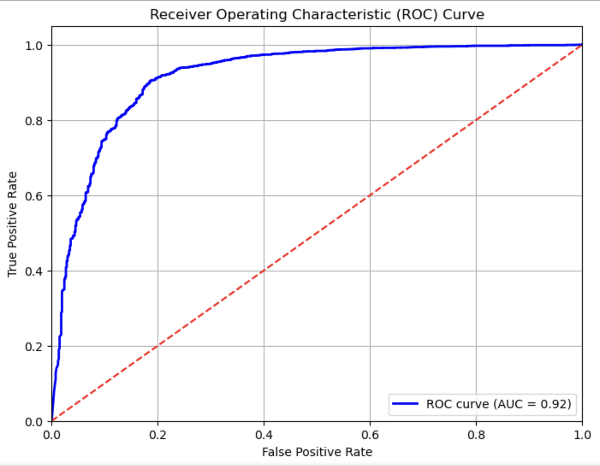

# Admetica

Predicting pharmacokinetic properties (ADMET: Absorption, Distribution, Metabolism, Excretion, and Toxicity) is 
essential for drug design. The earlier these properties can be reliably predicted, the better. 
While every company in the pharmaceutical industry requires this capability, there are currently no optimal solutions. 
Commercial tools are pricey, and public calculators have many limitations. Neither allows for easy customization.

Admetica addresses these challenges by offering a comprehensive set of pre-built predictive models, publicly 
available datasets, pipelines, and notebooks for training and evaluating models. It also provides tools for visual 
exploration of results—all under the permissive MIT license. It's a "batteries included" solution that is:

- **Accurate**: Built-in comparison with existing solutions ensures reliability.
- **Open-source**: The source code and data are freely available under the MIT license.
- **Simple to use**: CLI and REST APIs enable easy integration into existing workflows.
- **Configurable**: Customize settings or integrate your proprietary datasets into the pipeline.
- **Reproducible**: All scripts, notebooks, and training pipelines are included.
- **Fast**: Designed for high performance across datasets of all sizes.
- **Interpretable**: Tools for intuitive visual exploration of results.

Admetica is an open-source initiative with collaborators from academia, biotech startups, and big pharma.
Interested in collaborating? Contact us via [email](mailto:oserhiienko@datagrok.ai).

## Table of Contents

- [Usage](#usage)
- [Integration with Datagrok](#integration-with-datagrok)
- [Predictive models](#available-predictive-models): see [absorption](#absorption), [distribution](#distribution), [metabolism](#metabolism),
  [excretion](#excretion), [toxicity](#toxicity)
- [Novartis ADMET predictions](#novartis-admet-predictions)
  - [Comparison](#comparison-of-admetica-and-novartis-models)
  - [Enhancing Admetica with Novartis data](#model-enhancement)
- [Evaluation of free online ADMET tools](#evaluation-of-free-online-admet-tools): see [PPB](#plasma-protein-binding), [Half-Life](#half-life), [CYP3A4-Substrate](#cyp3a4-substrate), [HIA](#hia), [Summary](#summary-1)
- [References](#references)

## Usage

### CLI tool

#### Installation

[](https://badge.fury.io/py/chemprop)
[](https://badge.fury.io/py/chemprop)


```bash
pip install admetica==1.4.1
```

By default, the pip installation will include all necessary dependencies for making ADMET predictions.

#### Predicting

Through the command-line interface:

```bash
admetica_predict \
    --dataset-path data.csv \
    --smiles-column smiles \
    --properties Caco2,PPBR \
    --save-path predictions.csv
```

This command assumes the presence of a file named `data.csv` with SMILES strings in the column `smiles`. In addition,
you should specify the properties to be calculated (e.g. `Caco2`). The predictions will be saved to `predictions.csv`.

All models available in the repository are included and can be used.

### Web server

To simplify running Admetica locally as a web server, you can use the provided `setup.sh` script. This script automates the setup by building the Docker image, running the container, and launching the Swagger UI documentation page in your browser.

**Steps:**

1. Ensure Docker is installed and running on your system.
2. Run the `setup.sh` script from the `admetica_web` folder:

   ```bash
   ./setup.sh
   ```

This script will:
- Build a Docker image named `admetica`.
- Stop and remove any existing container named `admetica_container`.
- Run a new container, exposing Admetica’s API on port `8080`.
- Open the API documentation at [http://localhost:8080/apidocs](http://localhost:8080/apidocs) in your default browser.

The setup process should take about 2-3 minutes. If automatic URL opening is unsupported, manually open [http://localhost:8080/apidocs](http://localhost:8080/apidocs).

### Data

In order to train a model or obtain predictions, you must provide data containing molecules (as SMILES strings) and
known target values.

The data used in this research and [its overview](./docs/datasets.md) can be found in the `Datasets` folder.

### Training

You can create a model on your own using [chemprop](https://github.com/chemprop/chemprop/blob/master/README.md#training) module, or use publicly available models that are
located in the `Models` folder.

## Integration with Datagrok

Predicting properties is just the beginning of the journey. To make a system truly usable, we need 
to expose it to chemists and medicinal chemists via the UI, without the need to run Docker containers
or use CLI. Additionally, we want to easily interpret results in the context of the project
(where you can specify desirable property ranges, etc).

To address that, we have developed an MIT-licensed [Datagrok Admetica Plugin](https://github.com/datagrok-ai/public/tree/master/packages/Admetica) that allows scientists to 
calculate ADMET properties on demand. You can also visually assess results using a combination of color coding and a widget that fits in a grid cell and visualizes all properties at once. Additionally, the plugin enhances other Datagrok applications. For instance, [Hit Triage](https://github.com/datagrok-ai/public/blob/master/packages/HitTriage/README_HT.md) for triaging molecular campaigns and [Hit Design](https://github.com/datagrok-ai/public/blob/master/packages/HitTriage/README_HT.md) for collaborative, computation-augmented drug design.

Note that while both Admetica and Admetica Plugin are open-source, the Datagrok platform is proprietary.
It is free for personal use, for academia, and non-profit research. Claim your license [here](https://datagrok.ai).


## Available predictive models

Currently, we have a total of 23 predictive models developed for [Absorption](#absorption), [Distribution](#distribution), 
[Metabolism](#metabolism), [Excretion](#excretion) and [Toxicity](#toxicity).

### Absorption

#### Classification models

| Name                                                      | Model    | Size  | Specificity | Sensitivity | Accuracy | Balanced Accuracy | ROC AUC                   |
|-----------------------------------------------------------|----------|-------|-------------|-------------|----------|-------------------|---------------------------|
| [Pgp-Inhibitor](ADMET/absorption/absorption.md#pgp-inhibitor) | Chemprop | 1,275 | 0.916       | 0.863       | 0.888    | 0.889             |  |

#### Regression models

| Name                                                      | Model    | Size | MAE   | RMSE  | R2    | Spearman | Observed vs. Predicted                                                                    |
|-----------------------------------------------------------|----------|------|-------|-------|-------|----------|-------------------------------------------------------------------------------------------|
| [Caco2](ADMET/absorption/absorption.md#caco-2)       | Chemprop | 910  | 0.317 | 0.415 | 0.701 | 0.832    |                  |
| [Lipophilicity](ADMET/absorption/absorption.md#lipophilicity) | Chemprop | 4200 | 0.399 | 0.596 | 0.748 | 0.881    |  |
| [Solubility](ADMET/absorption/absorption.md#solubility)       | Chemprop | 9982 | 0.714 | 1.089 | 0.788 | 0.897    |        |

### Distribution

#### Regression models

| Name                                        | Model    | Size | MAE   | RMSE   | R2    | Spearman | Observed vs. Predicted                                                  |
|---------------------------------------------|----------|------|-------|--------|-------|----------|-------------------------------------------------------------------------|
| [PPBR](./distribution/distribution.md#ppbr) | Chemprop | 2790 | 6.919 | 11.294 | 0.609 | 0.762    |  |

### Metabolism

#### Classification models

| Name                                                              | Model    | Size   | Specificity | Sensitivity | Accuracy | Balanced Accuracy | ROC AUC                                                      |
|-------------------------------------------------------------------|----------|--------|-------------|-------------|----------|-------------------|--------------------------------------------------------------|
| [CYP1A2-Inhibitor](ADMET/absorption/absorption.md#cyp1a2-inhibitor)   | Chemprop | 13,239 | 0.873       | 0.866       | 0.87     | 0.869             |    |
| [CYP3A4-Inhibitor](ADMET/absorption/absorption.md#cyp3a4-inhibitor)   | Chemprop | 12,997 | 0.815       | 0.842       | 0.826    | 0.829             |    |
| [CYP3A4-Substrate](ADMET/absorption/absorption.md#cyp3a4-substrate)   | Chemprop | 1,149  | 0.569       | 0.779       | 0.718    | 0.674             |    |
| [CYP2C19-Inhibitor](ADMET/absorption/absorption.md#cyp2c19-inhibitor) | Chemprop | 13,427 | 0.819       | 0.830       | 0.824    | 0.825             |  |
| [CYP2C9-Inhibitor](ADMET/absorption/absorption.md#cyp2c9-inhibitor)   | Chemprop | 12,881 | 0.830       | 0.819       | 0.826    | 0.824             |    |
| [CYP2C9-Substrate](ADMET/absorption/absorption.md#cyp2c9-substrate)   | Chemprop | 899    | 0.728       | 0.757       | 0.738    | 0.742             |    |
| [CYP2D6-Inhibitor](ADMET/absorption/absorption.md#cyp2d6-inhibitor)   | Chemprop | 11,127 | 0.866       | 0.751       | 0.843    | 0.808             |    |
| [CYP2D6-Substrate](ADMET/absorption/absorption.md#cyp2d6-substrate)   | Chemprop | 941    | 0.749       | 0.769       | 0.753    | 0.759             |    |

Here is a line chart illustrating various metrics for each of the corresponding models.


### Excretion

#### Regression models

Name | Model | Size | MAE | RMSE | R2 | Spearman | Observed vs. Predicted |
|-|-|-|-|-|-|-|-|
| [Clearance Hepatocyte](./excretion/excretion.md#hepatocyte) | Chemprop | 1213 | 34.103 | 47.144 | 0.086 | 0.485 |  |
| [Clearance Microsome](./excretion/excretion.md#microsome) | Chemprop | 1102 |  26.715 | 39.201 | 0.216 | 0.576 |  |

### Toxicity

### Classification models

Name | Model | Size | Specificity | Sensitivity | Accuracy | Balanced Accuracy | ROC AUC
|-|-|-|-|-|-|-|-|
| [hERG](./ADMET/toxicity/toxicity.md#herg) | Chemprop | 22,249 | 0.811 | 0.897 | 0.885 |  0.854  |  |

#### Regression models

Name | Model | Size | MAE | RMSE | R2 | Spearman | Observed vs. Predicted |
|-|-|-|-|-|-|-|-|
| [LD50](./toxicity/toxicity.md#) | Chemprop | 7282 |  0.437 | 0.609 | 0.596 | 0.745 |  |

# Novartis ADMET predictions

Scientists from Novartis recently published a [paper in Nature](https://www.nature.com/articles/s41467-024-49979-3). The dataset comprises a total of 273,706 molecules, which includes 70,465 from ChEMBL, 199,972 from ZINC, and 3,269 from PROTAC-DB.
Naturally, we were curious how their results compare to Admetica ones. Also, if the Novartis predictions are
better (very likely since they have massive proprietary datasets), can we improve Admetica models
by training them on the publicly available Novartis predictions?

TL/DR: The Novartis models performed well on certain properties, such as CYP2C9-inhibitor, CYP3A4-inhibitor, and Caco-2, but were less effective on the CYP2D6-inhibitor. By incorporating
some predictions to the Admetica training dataset, we have improved some of the Admetica models.
See details below, or jump to the [summary](#summary).

## Comparison of Admetica and Novartis models

### Cytochrome P450

### Pipeline

We generated test datasets using data from the ChEMBL database. To ensure the test set was representative and produced 
accurate results, the data was preprocessed using the following steps:

* **Extracting common structures**:  
  We compared the Novartis and ChEMBL datasets to identify shared molecular structures. Additionally, we filtered out 
  values that overlapped with the Admetica training set to prevent redundancy.

* **Filtering the ChEMBL dataset**:  
  We removed duplicate entries, prioritizing those labeled as IC50. We also excluded rows with undesired types such as 
  Drug metabolism, FC, Retention_time, T1/2, mechanism based inhibition, Stability etc.

* **Processing values**:  
We standardized key values for consistency.

  | **Type**                | **Action**                                      |
  |-------------------------|-------------------------------------------------|
  | IC50, AC50, KI, Potency  | Converted to µM by dividing the values by 1000 |
  | Inhibition   | Classified as binary: |
  | | Greater than 50%: `1` |
  | | Less than 50%: `0`    |
  | Other values | Left unchanged (already in µM) |

Both the original ChEMBL dataset and the processed data are available in the [comparison](./comparison/novartis/cyp/) folder.
Additionally, the folder contains a Jupyter notebook, [preprocessing_pipeline.ipynb](./comparison/preprocessing_pipeline.ipynb), which fully 
reproduces the preprocessing steps and obtained datasets.

### 3A4

After performing the pipeline for ChEMBL 3A4, we obtained a dataset structured as follows:

| **Class** | **Number of entries** |
|-----------|-----------------------|
| Inhibitor   | 549                   |
| Non-Inhibitor   | 239                   |

We calculated CYP3A4-Inhibitor and assessed performance metrics for the Admetica and Novartis models, resulting
in the following outcomes:

| **Metric**                | **Admetica**   | **Novartis**   |
|---------------------------|-----------------------|-----------------------|
| True Positives (TP)      | 134.0                 | 159.0                 |
| True Negatives (TN)      | 368.0                 | 352.0                 |
| False Positives (FP)     | 181.0                 | 197.0                 |
| False Negatives (FN)     | 105.0                 | 80.0                  |
| Sensitivity (Recall)     | 0.5607                | 0.6653                |
| Specificity              | 0.6703                | 0.6412                |
| Balanced Accuracy         | 0.6155                | 0.6532                |
| AUC                       | 0.6155                | 0.6532                |


### 2C9

After performing the pipeline for ChEMBL 2C9, we obtained a dataset structured as follows:

| **Class** | **Number of entries** |
|-----------|-----------------------|
| Inhibitor   | 329                   |
| Non-Inhibitor   | 135                   |

We calculated CYP2C9-Inhibitor and assessed performance metrics for the Admetica and Novartis models, 
resulting in the following outcomes:

| **Metric**                | **Admetica**    | **Novartis**   |
|---------------------------|-----------------------|-----------------------|
| True Positives (TP)      | 102.0                 | 69.0                  |
| True Negatives (TN)      | 137.0                 | 236.0                 |
| False Positives (FP)     | 192.0                 | 93.0                  |
| False Negatives (FN)     | 33.0                  | 66.0                  |
| Sensitivity (Recall)     | 0.7556                | 0.5111                |
| Specificity              | 0.4164                | 0.7173                |
| Balanced Accuracy         | 0.5860                | 0.6142                |
| AUC                       | 0.5860                | 0.6142                |


### 2D6

After performing the pipeline for ChEMBL 2D6, we obtained a dataset structured as follows:

| **Class** | **Number of entries** |
|-----------|-----------------------|
| Inhibitor   | 444                   |
| Non-Inhibitor   | 195                   |

We calculated CYP2D6-Inhibitor and assessed performance metrics for the Admetica and Novartis models, 
resulting in the following outcomes:

| **Metric**                | **Admetica**   | **Novartis**   |
|---------------------------|-----------------------|-----------------------|
| True Positives (TP)      | 88.0                  | 55.0                  |
| True Negatives (TN)      | 329.0                 | 403.0                 |
| False Positives (FP)     | 115.0                 | 41.0                  |
| False Negatives (FN)     | 107.0                 | 140.0                 |
| Sensitivity (Recall)     | 0.4513                | 0.2821                |
| Specificity              | 0.7410                | 0.9077                |
| Balanced Accuracy         | 0.5961                | 0.5949                |
| AUC                       | 0.5961                | 0.5949                |


The comparison is fully reproducible, and you can find the Jupyter notebook, [comparison_cyp.ipynb](./comparison/comparison_cyp.ipynb), 
in the folder.


### Caco-2 permeability

We generated test datasets using data from the supplementary material of the paper 
[In Silico Prediction of Caco-2 Cell Permeability by a Classification QSAR Approach](https://pubmed.ncbi.nlm.nih.gov/27466954/). The following preprocessing 
steps were applied:

*  **Identifying common structures**:

   We compared the Novartis and Caco-2 dataset to identify shared molecular structures. Additionally, we filtered out
* values that overlapped with the Admetica training set to prevent redundancy.
   
* **Unit normalization**:  
   
   To ensure consistent units across all datasets predicting Caco-2 permeability (including Novartis and Admetica), we 
* applied a log10 transformation to the values.

After performing the preprocessing for Caco-2, we obtained a dataset that contains 34 structures.

We calculated Caco-2 and assessed performance metrics for the Admetica and Novartis models, resulting in the following 
outcomes:

| **Metric**   | **Admetica**   | **Novartis**   |
|--------------|----------------|----------|
| MAE          | 0.411552       | 0.351543 |
| MSE          | 0.286792       | 0.201841 |
| RMSE         | 0.535530       | 0.449267 |
| R²           | 0.319010       | 0.520728 |

<table>
  <tr>
    <td></td>
    <td></td>
  </tr>
</table>

Both the original Caco-2 dataset and the processed data are available in the [comparison](./comparison/novartis/caco2/) folder. Additionally, 
the folder contains a Jupyter notebook, [comparison_caco2.ipynb](./comparison/comparison_caco2.ipynb), which fully reproduces the preprocessing steps, 
obtained datasets and metrics.

### Results

During our model comparison, we discovered that the Novartis model outperformed the Admetica model for the targets 
CYP3A4, CYP2C9, and Caco2.

## Model enhancement

After performing the comparison and seeing that in some cases the Novartis model is better, we consequently opted to 
continue training with the surrogate Novartis data used in our comparison.

### Data preparation

Given the significant class imbalance in the data for CYP3A4 and CYP2C9, we implemented under-sampling techniques to 
reduce the risk of overfitting during the training process.

| **Property** | **Class distribution** | **Number of rows in final dataset** |
|--------------|-----------------------|-------------------------------------|
| **CYP3A4**   | 0: 22618, 1: 22618    | 57781                               |
| **CYP2C9**   | 0: 3975, 1: 3975      | 20299                               |

This table summarizes the class distributions and the row counts in the final dataset for each property.

For further details, the [comparison](./comparison/) folder contains a Jupyter notebook, [undersampling.ipynb](./comparison/undersampling.ipynb), that fully reproduces the process of obtaining the final datasets for training.

Using the same [pipeline](#pipeline) from our comparison, we assessed the performance metrics of the newly trained models. The results are summarized in the tables below.

### CYP3A4-Inhibitor

| Metric                 | Admetica (Baseline) | Admetica (Enhanced) | Novartis   |
|------------------------|---------------------|----------------------|------------|
| True Positives (TP)    | 134.0               | 163.0                | 159.0      |
| True Negatives (TN)    | 368.0               | 334.0                | 352.0      |
| False Positives (FP)   | 181.0               | 215.0                | 197.0      |
| False Negatives (FN)   | 105.0               | 76.0                 | 80.0       |
| Sensitivity (Recall)    | 0.5607              | 0.6820               | 0.6653     |
| Specificity            | 0.6703              | 0.6084               | 0.6412     |
| Balanced Accuracy      | 0.6155              | 0.6452               | 0.6532     |
| AUC                    | 0.6155              | 0.6452               | 0.6532     ||


### CYP2C9-Inhibitor

| Metric                 | Admetica (Baseline) | Admetica (Enhanced) | Novartis   |
|------------------------|---------------------|----------------------|------------|
| True Positives (TP)    | 102.0               | 71.0                 | 69.0       |
| True Negatives (TN)    | 137.0               | 232.0                | 236.0      |
| False Positives (FP)   | 192.0               | 97.0                 | 93.0       |
| False Negatives (FN)   | 33.0                | 64.0                 | 66.0       |
| Sensitivity (Recall)    | 0.7556              | 0.5259               | 0.5111     |
| Specificity            | 0.4164              | 0.7052               | 0.7173     |
| Balanced Accuracy      | 0.5860              | 0.6155               | 0.6142     |
| AUC                    | 0.5860              | 0.6155               | 0.6142     ||


### Caco-2

| Metric   | Admetica (Baseline) | Admetica (Enhanced) | Novartis   |
|----------|---------------------|----------------------|------------|
| MAE      | 0.411552            | 0.364398             | 0.351543   |
| MSE      | 0.286792            | 0.195037             | 0.201841   |
| RMSE     | 0.535530            | 0.441630             | 0.449267   |
| R²       | 0.319010            | 0.536883             | 0.520728   |

<table>
  <tr>
    <td></td>
    <td></td>
  </tr>
</table>

### Summary

| **Metric**             | **Δ (Enhanced - Baseline)** | **% Improvement**       |
|------------------------|-----------------------------|-------------------------|
| **CYP3A4-Inhibitor**   |                             |                         |
| True Positives (TP)    | **+29.0** ↑                 | **+21.6%** ✅           |
| True Negatives (TN)    | **-34.0** ↓                 | **-9.2%** ❌            |
| False Positives (FP)   | **+34.0** ↑                 | **+18.8%** ❌           |
| False Negatives (FN)   | **-29.0** ↓                 | **-27.6%** ✅           |
| Sensitivity (Recall)    | **+0.1213** ↑               | **+21.6%** ✅           |
| Specificity            | **-0.0619** ↓               | **-9.2%** ❌            |
| Balanced Accuracy      | **+0.0297** ↑               | **+4.8%** ✅            |
| AUC                    | **+0.0297** ↑               | **+4.8%** ✅            |
| **CYP2C9-Inhibitor**   |                             |                         |
| True Positives (TP)    | **-31.0** ↓                 | **-30.4%** ❌           |
| True Negatives (TN)    | **+95.0** ↑                 | **+69.3%** ✅           |
| False Positives (FP)   | **-95.0** ↓                 | **-49.5%** ✅           |
| False Negatives (FN)   | **+31.0** ↑                 | **+94.0%** ❌           |
| Sensitivity (Recall)    | **-0.2297** ↓               | **-30.4%** ❌           |
| Specificity            | **+0.2888** ↑               | **+69.3%** ✅           |
| Balanced Accuracy      | **+0.0295** ↑               | **+5.0%** ✅            |
| AUC                    | **+0.0295** ↑               | **+5.0%** ✅            |
| **Caco-2**             |                             |                         |
| MAE                    | **-0.047154** ↓             | **-11.4%** ✅           |
| MSE                    | **-0.091755** ↓             | **-31.9%** ✅           |
| RMSE                   | **-0.093900** ↓             | **-17.6%** ✅           |
| R²                     | **+0.217873** ↑             | **+68.2%** ✅           |

Where:
- **↑**: Improvement
- **↓**: Decline
- **✅**: Positive Improvement
- **❌**: Negative Improvement

## Evaluation of free online ADMET tools

For our evaluation, we used 24 tyrosine kinase inhibitors (TKIs) and a comparison table from the supplementary materials of the study [Evaluation of Free Online ADMET Tools for Academic or Small Biotech Environments](https://pubmed.ncbi.nlm.nih.gov/36677832/). The table contained predictions for the 24 structures from various web services, including ADMETlab, admetSAR, SwissADME, and others. Since the table was slightly outdated, we updated the ADMETlab 2.0 predictions with those from ADMETlab 3.0.

### Plasma Protein Binding

We compared plasma protein binding (PPB) predictions for 24 tyrosine kinase inhibitors (TKIs) using four tools: [ADMETLab](https://admetlab3.scbdd.com/), [admetSAR](https://lmmd.ecust.edu.cn/admetsar2/), [preADMET](https://preadmet.webservice.bmdrc.org/), and Admetica. The plot below shows the results.


| Model      |        MSE        |       MAE       |       RMSE       |
|------------|-------------------|------------------|-------------------|
| ADMETLab   |  37.42            |  3.25            |  6.12             |
| admetSAR   | 148.04            |  6.71            | 12.17             |
| Admetica   | 139.08            |  8.52            | 11.79             |
| preADMET   | 265.00            | 13.00            | 16.28             |

ADMETLab consistently provided the most accurate predictions, achieving the lowest error metrics across all measures (MSE, MAE, RMSE). Admetica and admetSAR had similar performance, with Admetica exhibiting slightly better metrics overall, despite both having higher error rates compared to ADMETLab. PreADMET showed the least accuracy overall, as indicated by its significantly higher error metrics. Overall, ADMETLab remains the top choice for precise plasma protein binding predictions.

### Half-Life

Among all online web services, only [ADMETLab](https://admetlab3.scbdd.com/) provides predictions for Half-Life. To assess the accuracy of these predictions, we performed a comparative analysis between ADMETLab and Admetica for 24 structures.


| Model      |        MSE         |       MAE         |       RMSE        |
|------------|--------------------|--------------------|--------------------|
| ADMETLab   | 1647.99            | 32.86              | 40.60              |
| Admetica   | 1162.88            | 29.21              | 34.10              |

ADMETLab tends to underestimate Half-Life predictions compared to actual values, resulting in relatively high error metrics. In contrast, Admetica often overestimates Half-Life, but it has lower error metrics overall. This disparity highlights the importance of carefully evaluating the predictions from both tools, as they exhibit different tendencies in their predictions, leading to significant variability.

### CYP3A4-Substrate

We compared CYP3A4 substrate predictions using five tools: [ADMETLab](https://admetlab3.scbdd.com/), [admetSAR](https://lmmd.ecust.edu.cn/admetsar2/), [pkCSM](http://pkcsmlab.com/), [preADMET](https://preadmet.webservice.bmdrc.org/), and Admetica.


| Model      | Accuracy | Precision | Recall | F1 Score |
|------------|----------|-----------|--------|----------|
| ADMETLab   |   0.83   |    1.0    |  0.83  |   0.91   |
| admetSAR   |   1.0    |    1.0    |  1.0   |   1.0    |
| pkCSM      |   0.96   |    1.0    |  0.96  |   0.98   |
| preADMET   |   0.46   |    1.0    |  0.46  |   0.63   |
| Admetica   |   0.96   |    1.0    |  0.96  |   0.98   |

The results revealed that admetSAR was the best-performing model, demonstrating exceptional accuracy in predicting CYP3A4 substrates. Both pkCSM and Admetica also showed strong performance, making them reliable options for these predictions. ADMETLab provided decent results, but its performance was not as robust as the top three models. Conversely, preADMET exhibited the lowest performance, indicating that it is less reliable for CYP3A4 substrate predictions. Overall, we can confidently rely on admetSAR, pkCSM, and Admetica for accurate predictions in this area.

### HIA

We compared models for predicting human intestinal absorption (HIA) using six free tools: [ADMETLab](https://admetlab3.scbdd.com/), [admetSAR](https://lmmd.ecust.edu.cn/admetsar2/), [FAF-Drug4](https://fafdrugs4.rpbs.univ-paris-diderot.fr/), [pkCSM](http://pkcsmlab.com/), [SwissADME](http://www.swissadme.ch/), and Admetica.


| Model       | Accuracy | Precision | Recall |
|-------------|----------|-----------|--------|
| ADMETLab    |   0.62   |   0.61    |  1.0   |
| SwissADMET  |   0.62   |   0.63    |  0.86  |
| admetSAR    |   0.58   |   0.58    |  1.0   |
| FAF-Drug4   |   0.58   |   0.58    |  1.0   |
| pkCSM       |   0.58   |   0.58    |  1.0   |
| Admetica    |   0.58   |   0.58    |  1.0   |

ADMETLab and SwissADMET demonstrated the highest accuracy, effectively identifying absorbed compounds, while admetSAR, FAF-Drug4, pkCSM, and Admetica showed similar performance levels but lower precision. Overall, all models exhibited perfect recall, indicating their effectiveness in identifying absorbed compounds, though there is still room for improvement in minimizing false positives.

You can find both the original dataset and the processed data in the [comparison](./comparison/predictors/) folder. This folder also includes a Jupyter notebook, [comparison_services.ipynb](./comparison/comparison_services.ipynb), that reproduces the steps taken to conduct the comparison.

### Summary

Below is a summary table of the most notable metrics from the evaluation of free online ADMET tools using predictions for 24 tyrosine kinase inhibitors (TKIs).

| Model      | PPB (F1) | Half-Life (MAE) | CYP3A4 Substrate (F1) | HIA (Accuracy) |
|------------|----------|------------------|------------------------|-----------------|
| ADMETLab   | 0.91     | 32.86            | 0.83                   | 0.62            |
| admetSAR   | 1.00     | N/A              | 1.00                   | 0.58            |
| Admetica   | 0.98     | 29.21            | 0.98                   | 0.58            |
| pkCSM      | N/A      | N/A              | 0.98                   | 0.58            |
| preADMET   | N/A      | N/A              | 0.63                   | 0.58            |
| FAF-Drug4  | N/A      | N/A              | N/A                    | 0.58            |
| SwissADME  | N/A      | N/A              | N/A                    | 0.62            |


## References

Our project is about improving and combining existing solutions, not reinventing the wheel. 
Here are some of the resources is the list of resources we've investigated:

1. ADMETlab: a platform for systematic ADMET evaluation based on a comprehensively collected ADMET database / Jie Dong, Ning-Ning Wang, Zhi-Jiang Yao та ін. // J Cheminform. – 2018. – <https://www.ncbi.nlm.nih.gov/pmc/articles/PMC6020094/>.
2. Evaluation of Free Online ADMET Tools for Academic or Small Biotech Environments / Júlia Dulsat, Blanca López-Nieto, Roger Estrada-Tejedor, José I. Borrell // Molecules. – 2023. – <https://www.ncbi.nlm.nih.gov/pmc/articles/PMC9864198/>.
3. Vishwesh Venkatraman. FP-ADMET: a compendium of fingerprint-based ADMET prediction models / Vishwesh Venkatraman // J Cheminform. – 2021. – <https://www.ncbi.nlm.nih.gov/pmc/articles/PMC8479898/>.
4. Front Pharmacol. vNN Web Server for ADMET Predictions / Front Pharmacol // Front Pharmacol. – 2017. – <https://www.ncbi.nlm.nih.gov/pmc/articles/PMC5722789/>.
5. ADMETlab 2.0: an integrated online platform for accurate and comprehensive predictions of ADMET properties / Guoli Xiong, Zhenxing Wu, Jiacai Yi та ін. // Nucleic Acids Res. – 2021. – <https://www.ncbi.nlm.nih.gov/pmc/articles/PMC8262709/>.
6. In silico Prediction of Chemical Ames Mutagenicity / Congying Xu, Feixiong Cheng, Lei Chen та ін. // J Cheminform. – 2012. – <https://pubs.acs.org/doi/abs/10.1021/ci300400a>.
7. Computational Models for Human and Animal Hepatotoxicity with a Global Application Scope / Denis Mulliner, Friedemann Schmidt, Manuela Stolte та ін. // Chem. Res. Toxicol.. – 2016. – <https://pubs.acs.org/doi/10.1021/acs.chemrestox.5b00465>.
8. ADMET Evaluation in Drug Discovery. 16. Predicting hERG Blockers by Combining Multiple Pharmacophores and Machine Learning Approaches / Shuangquan Wang, Huiyong Sun, Hui Liu та ін. // Mol. Pharmaceutics. – 2016. – <https://pubs.acs.org/doi/10.1021/acs.molpharmaceut.6b00471>.
9. [Application of machine learning models for property prediction to targeted protein degraders](https://www.nature.com/articles/s41467-024-49979-3)
